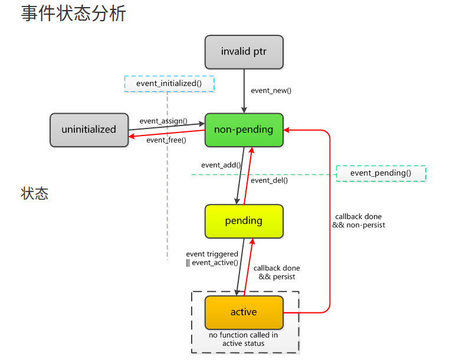

## 事件event处理

- 已初始化（initialized）
  
  - 调用event_new之后
- 待决（pending）
  - 调用event_add之后
    - 只有此状态才会调用事件回调
- 激活（active）
  
  - 事件发生，包括超时事件
- 持久的（persistent）
  
- 如果没设置持久每次事件函数调用后，状态就变味非待决，也就收不到事件了，需要再次调用event_add
  
- ### event *event_new(struct event_base *base, evutil_socket_t fd,short what, event_callback_fn cb,void *arg);

- event_base *base

  - 上下文

- evutil_socket_t fd

  - 监听的文件描述符

- short what

  - 事件标志
    - EV_TIMEOUT
      - 超时，默认是忽略的，只有在添加事件时设置超时时间才有效
    - EV_READ
    - EV_WRITE
    - EV_SIGNAL
      - 需要构造信号事件
    - EV_PERSIST
      - 持久的(事件处理之后回到pending而不是non-pending)
    - EV_ET
      - 边缘触发，需要底层支持，2.0以上支持，影响EV*READ和EV*WRITE
    - <event2/event.h>
    - 示例：EV*READ|EV*PERSIST

- ### event_callback_fn cb

  - 事件的回调函数
    - typedef void (*event_callback_fn)(evutil_socket_t, short, void *);
    - evutil_socket_t
      - 发生事件的文件描述符
    - short_what
      - 事件标志
    - void *arg
      - 传递的参数

- void *arg

  - 给回调传递的参数

- 调用完状态为

  - initialized and non-pending
    - 已初始化和未待决

### event_assign

- int event*assign(struct event \*event, struct event*base *base, util_socket_t fd, short what, id (*callback)(evutil*socket*t, short, void *), void *arg);

### event_add

- 调用完状态为
  - pending
    - 已待决
- int event_add(struct event *ev, const struct timeval *tv);

### event_del

- int event_del(struct event *ev);
- makes it non-pending and non-active.
- If the event was not pending or active, there is no effect

### event_free

- void event_free(struct event *event);
  - 已待决和激活状态调用安全
    - 清理空间前会使得状态变为未待决和非激活

## linux信号事件示例

### Ctrl+C 信号处理

## 定时器事件示例

### api

- event*new(base, -1,EV*PERSIST, timer2,0)

- evtimer

  new(base, timer1, event

  self_cbarg());

  - 非持久

- evtimer_del(ev);

- evtimer_add(ev, &t1);

- timeval

  - struct timeval {
  - long tv_sec; /* seconds */
  - long tv_usec; /* and microseconds */
  - };

### 双链队列 O（1） 大量具有相同超时值

- event*base*init*common*timeout

### 跟踪未决事件的超时值 binary heap

- 添加和删除 O(logN)
  - 完全二元树
    - 最大堆
    - 最小堆
  - 二叉堆

## linux下文件读取事件示例

### 监控系统日志

- /var/log/auth.log

- EV

  FEATURE

  FDS

  - event*config*require*features(conf, EV*FEATURE_FDS);

- int open(const char *pathname, int flags);

- off

  t lseek(int fd, off

  t offset, int whence);

  - lseek(socket,0,SEEK_END);

- ssize*t read(int fd, void \*buf, size*t count);

## 网络服务器事件示例（echo）

### 接收连接

### 读取数据-返回数据